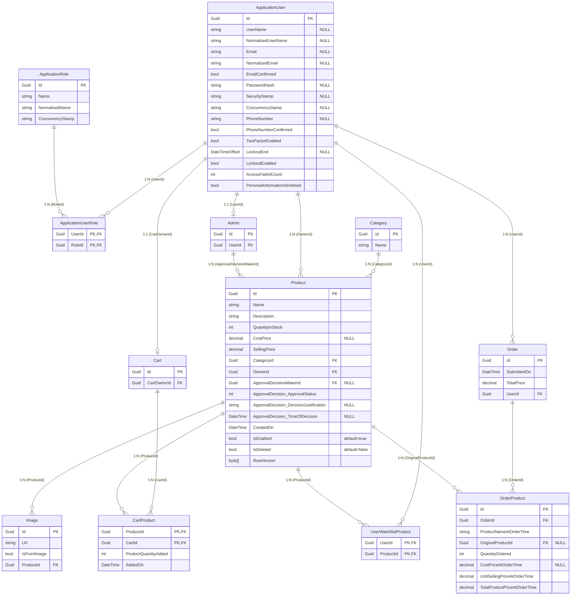

# TradeNest Entity Relationship Diagram

```mermaid
erDiagram
    ApplicationUser {
        Guid Id PK
        string UserName "NULL"
        string NormalizedUserName "NULL"
        string Email "NULL"
        string NormalizedEmail "NULL"
        bool EmailConfirmed
        string PasswordHash "NULL"
        string SecurityStamp "NULL"
        string ConcurrencyStamp "NULL"
        string PhoneNumber "NULL"
        bool PhoneNumberConfirmed
        bool TwoFactorEnabled
        DateTimeOffset LockoutEnd "NULL"
        bool LockoutEnabled
        int AccessFailedCount
        bool PersonalInformationIsDeleted
    }
    ApplicationRole {
        Guid Id PK
        string Name
        string NormalizedName
        string ConcurrencyStamp
    }
    ApplicationUserRole {
        Guid UserId PK, FK
        Guid RoleId PK, FK
    }
    Admin {
        Guid Id PK
        Guid UserId FK
    }
    Cart {
        Guid Id PK
        Guid CartOwnerId FK
    }
    Category {
        Guid Id PK
        string Name
    }
    Product {
        Guid Id PK
        string Name
        string Description
        int QuantityInStock
        decimal CostPrice "NULL"
        decimal SellingPrice
        Guid CategoryId FK
        Guid OwnerId FK
        Guid ApprovalDecisionMakerId FK "NULL"
        int ApprovalDecision_ApprovalStatus
        string ApprovalDecision_DecisionJustification "NULL"
        DateTime ApprovalDecision_TimeOfDecision "NULL"
        DateTime CreatedOn
        bool IsEnabled "default=true"
        bool IsDeleted "default=false"
        byte[] RowVersion
    }
    Image {
        Guid Id PK
        string Url
        bool IsFrontImage
        Guid ProductId FK
    }
    CartProduct {
        Guid ProductId PK, FK
        Guid CartId PK, FK
        int ProductQuantityAdded
        DateTime AddedOn
    }
    UserWatchlistProduct {
        Guid UserId PK, FK
        Guid ProductId PK, FK
    }
    Order {
        Guid Id PK
        DateTime SubmittedOn
        decimal TotalPrice
        Guid UserId FK
    }
    OrderProduct {
        Guid Id PK
        Guid OrderId FK
        string ProductNameAtOrderTime
        Guid OriginalProductId FK "NULL"
        int QuantityOrdered
        decimal CostPriceAtOrderTime "NULL"
        decimal UnitSellingPriceAtOrderTime
        decimal TotalProductPriceAtOrderTime
    }

    ApplicationUser ||--o{ ApplicationUserRole : "1:N (UserId)"
    ApplicationRole ||--o{ ApplicationUserRole : "1:N (RoleId)"
    ApplicationUser ||--o| Admin : "1:1 (UserId)"
    ApplicationUser ||--o| Cart : "1:1 (CartOwnerId)"

    Category ||--o{ Product : "1:N (CategoryId)"
    Product ||--o{ Image : "1:N (ProductId)"
    ApplicationUser ||--o{ Product : "1:N (OwnerId)"
    Admin ||--o{ Product : "1:N (ApprovalDecisionMakerId)"

    Cart ||--o{ CartProduct : "1:N (CartId)"
    Product ||--o{ CartProduct : "1:N (ProductId)"
    ApplicationUser ||--o{ UserWatchlistProduct : "1:N (UserId)"
    Product ||--o{ UserWatchlistProduct : "1:N (ProductId)"

    ApplicationUser ||--o{ Order : "1:N (UserId)"
    Order ||--o{ OrderProduct : "1:N (OrderId)"
    Product ||--o{ OrderProduct : "1:N (OriginalProductId)"
```