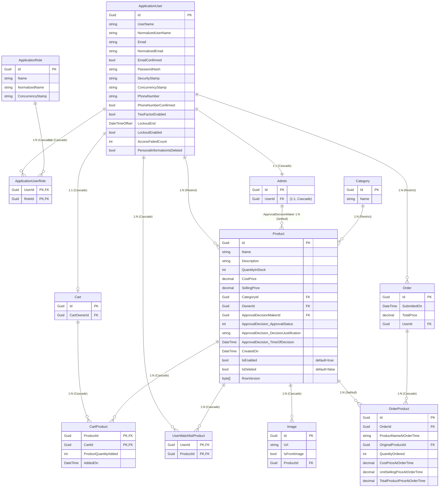

# TradeNest Entity Relationship Diagram

```mermaid
erDiagram
    %% ===== IDENTITY & USERS =====
    ApplicationUser {
        Guid Id PK
        string UserName
        string NormalizedUserName
        string Email
        string NormalizedEmail
        bool EmailConfirmed
        string PasswordHash
        string SecurityStamp
        string ConcurrencyStamp
        string PhoneNumber
        bool PhoneNumberConfirmed
        bool TwoFactorEnabled
        DateTimeOffset LockoutEnd
        bool LockoutEnabled
        int AccessFailedCount
        bool PersonalInformationIsDeleted
    }

    ApplicationRole {
        Guid Id PK
        string Name
        string NormalizedName
        string ConcurrencyStamp
    }

    ApplicationUserRole {
        Guid UserId PK, FK
        Guid RoleId PK, FK
    }

    Admin {
        Guid Id PK
        Guid UserId FK "(1:1, Cascade)"
    }

    %% ===== CATALOG =====
    Category {
        Guid Id PK
        string Name
    }

    Product {
        Guid Id PK
        string Name
        string Description
        int QuantityInStock
        decimal CostPrice
        decimal SellingPrice
        Guid CategoryId FK 
        Guid OwnerId FK 
        Guid ApprovalDecisionMakerId FK 
        int ApprovalDecision_ApprovalStatus
        string ApprovalDecision_DecisionJustification
        DateTime ApprovalDecision_TimeOfDecision
        DateTime CreatedOn 
        bool IsEnabled "default=true"
        bool IsDeleted "default=false"
        byte[] RowVersion
    }

    Image {
        Guid Id PK
        string Url
        bool IsFrontImage 
        Guid ProductId FK 
    }

    %% ===== CART & WATCHLIST =====
    Cart {
        Guid Id PK
        Guid CartOwnerId FK 
    }

    CartProduct {
        Guid ProductId PK, FK 
        Guid CartId PK, FK 
        int ProductQuantityAdded
        DateTime AddedOn 
    }

    UserWatchlistProduct {
        Guid UserId PK, FK 
        Guid ProductId PK, FK 
    }

    %% ===== ORDERS =====
    Order {
        Guid Id PK
        DateTime SubmittedOn 
        decimal TotalPrice
        Guid UserId FK 
    }

    OrderProduct {
        Guid Id PK
        Guid OrderId FK 
        string ProductNameAtOrderTime
        Guid OriginalProductId FK 
        int QuantityOrdered
        decimal CostPriceAtOrderTime
        decimal UnitSellingPriceAtOrderTime
        decimal TotalProductPriceAtOrderTime 
    }

    %% ===== RELATIONSHIPS =====
    
    %% ApplicationUser }|..o{ ApplicationRole : "N:M via ApplicationUserRole"
    ApplicationUser ||--o{ ApplicationUserRole : "1:N (Cascade)"
    ApplicationRole ||--o{ ApplicationUserRole : "1:N (Cascade)"
    
    ApplicationUser ||--o| Cart : "1:1 (Cascade)"
    ApplicationUser ||--|| Admin : "1:1 (Cascade)"
    ApplicationUser ||--o{ Product : "1:N (Restrict)"
    ApplicationUser ||--o{ Order : "1:N (Restrict)"
    
    %% ApplicationUser }o--o{ Product : "Watchlist N:M via UserWatchlistProduct"
    ApplicationUser ||--o{ UserWatchlistProduct : "1:N (Cascade)"
    Product ||--o{ UserWatchlistProduct : "1:N (Cascade)"
    
    Admin ||--o{ Product : "ApprovalDecisionMaker 1:N (SetNull)"
    
    Cart ||--o{ CartProduct : "1:N (Cascade)"
    Product ||--o{ CartProduct : "1:N (Cascade)"

    Category ||--o{ Product : "1:N (Restrict)"

    Product ||--o{ Image : "1:N (Cascade)"
    
    Product ||--o{ OrderProduct : "1:N (SetNull)"
    Order ||--o{ OrderProduct : "1:N (Cascade)"
```